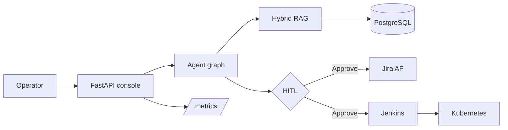

# AetherForge

**Industrial Knowledge OS** — hybrid RAG, multi-agent workflows, Jira-native execution, Jenkins promotion gates, PostgreSQL state, and Kubernetes delivery.

Not another generic “enterprise dashboard.” AetherForge is the control plane a platform team would actually run: retrieve a runbook, draft the ticket, wait for a human, then queue the pipeline.

[](https://github.com/Ananyanagaraj11/aetherforge/actions)


<p align="center">
  <a href="https://aetherforge.onrender.com"><strong>Live demo</strong></a> ·
  <a href="https://aetherforge.onrender.com/docs"><strong>API docs</strong></a> ·
  <a href="docs/ARCHITECTURE.md"><strong>Architecture</strong></a>
</p>

---

## What recruiters should see

| Layer | What ships |
|-------|------------|
| **Knowledge** | Hybrid search: BM25 + TF-IDF vectors + reciprocal rank fusion + title rerank. Cite-or-abstain. |
| **Agents** | Retriever → Analyst → Planner → Reviewer. HITL before any Jira write. |
| **Work tracking** | Project **AF** board (To Do / In Progress / CAB Review / In Review / Done). |
| **Delivery** | `Jenkinsfile` with lint, pytest, image, staging deploy, **HITL promote to prod**. |
| **Data** | PostgreSQL schema for docs, chunks, runs, HITL, Jira, Jenkins, audit. |
| **Runtime** | Kubernetes Deployment + Service + HPA + Ingress + Postgres StatefulSet. |
| **Ops** | `/health`, `/metrics` (Prometheus), append-only audit log. |



---

## Live demo

| Surface | URL |
|---------|-----|
| Console | https://aetherforge.onrender.com |
| OpenAPI | https://aetherforge.onrender.com/docs |
| Health | https://aetherforge.onrender.com/health |

Try these prompts on **Command**:

1. HVAC zone 4 supply temperature is drifting. What is the runbook and should we open a ticket?
2. How do we roll back a failed Kubernetes production release?
3. PostgreSQL replica lag is over 30 seconds. What is the escalation path?
4. Who has to approve a production schema change before Jenkins can promote?

Approve the HITL card — a new **AF-**** issue appears on the Jira board and a Jenkins job is queued.

[](https://render.com/deploy?repo=https://github.com/Ananyanagaraj11/aetherforge)

---

## Quick start

```bash
git clone https://github.com/Ananyanagaraj11/aetherforge
cd aetherforge
python -m venv .venv
.venv\Scripts\activate          # Windows
pip install -r requirements.txt
$env:PYTHONPATH = "src"         # Windows PowerShell
uvicorn aetherforge.api.main:app --reload --port 8080
```

Open **http://localhost:8080**

```bash
curl -X POST http://localhost:8080/api/ask ^
  -H "Content-Type: application/json" ^
  -d "{\"query\":\"How do we roll back a failed Kubernetes production release?\"}"
```

### PostgreSQL + Redis (company-shaped local stack)

```bash
docker compose up --build
```

---

## Repository map

```
├── dashboard/                 # Industrial console (Command, Knowledge, Jira, HITL, Jenkins)
├── src/aetherforge/
│   ├── api/main.py            # FastAPI control plane
│   ├── agents/orchestrator.py # Retriever → Analyst → Planner → Reviewer
│   ├── rag/hybrid.py          # BM25 + TF-IDF + RRF
│   ├── integrations/jira.py   # AF board + HITL → ticket
│   └── storage/               # SQLAlchemy / PostgreSQL
├── infra/kubernetes/          # Deployment, HPA, Ingress, Postgres
├── Jenkinsfile                # Lint → test → image → staging → HITL prod
├── docker-compose.yml
└── tests/
```

---

## Interview walkthrough (90 seconds)

“AetherForge is a knowledge OS I built to show production AI plus platform engineering. An operator asks a question. Hybrid retrieval pulls the runbook. An analyst is not allowed to answer without citations. A planner drafts a Jira issue and picks the Jenkins job. A reviewer blocks Jira writes until a human approves. State lives in PostgreSQL. The same repo has the Kubernetes manifests and the Jenkins promotion pipeline.”

---

## Author

**Ananya Naga Raj** — AI / Backend Engineer · [GitHub](https://github.com/Ananyanagaraj11)

MIT License
