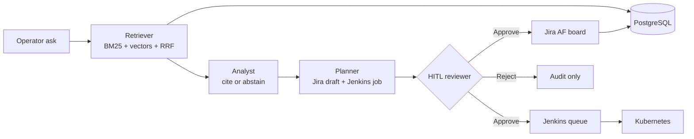

# AetherForge · Knowledge OS

> Ask a production question. Get a **cited runbook**. Draft a **Jira ticket**. Wait for a **human**. Then queue **Jenkins**.

A company-style control plane for industrial / platform teams — not a chatbot demo.

<p align="center">
  <a href="https://aetherforge-hgfm.onrender.com"><strong>▶ Live demo</strong></a>&nbsp;·&nbsp;
  <a href="https://aetherforge-hgfm.onrender.com/docs"><strong>API / Swagger</strong></a>&nbsp;·&nbsp;
  <a href="docs/ARCHITECTURE.md"><strong>Architecture</strong></a>
</p>

[](https://github.com/Ananyanagaraj11/aetherforge/actions)


---

## Highlights


| # | About | Where it lives |
|---|--------------------------------|----------------|
| 1 | **Hybrid RAG that cites or abstains** — BM25 + TF-IDF vectors + Reciprocal Rank Fusion + rerank. No source chunk → no invented procedure. | `src/aetherforge/rag/` |
| 2 | **4-agent graph** — Retriever → Analyst → Planner → Reviewer. Same shape as production LangGraph / HITL systems. | `src/aetherforge/agents/orchestrator.py` |
| 3 | **Jira-native close-the-loop** — planner drafts an **AF-*** issue; nothing is written until a human clicks Approve. | Console → Jira board |
| 4 | **Jenkins promotion gates** — lint → pytest → image → staging; **production promote requires HITL**. | `Jenkinsfile` |
| 5 | **PostgreSQL as the system of record** — documents, chunks, workflow runs, HITL reviews, Jira projection, Jenkins jobs, append-only audit. | `src/aetherforge/storage/` |
| 6 | **Kubernetes, not just a Dockerfile** — Deployment (2 replicas), Service, HPA 2–8, Ingress, Postgres StatefulSet, Prometheus scrape annotations. | `infra/kubernetes/` |
| 7 | **Ops that look like a real service** — `/health`, `/metrics`, OpenAPI, CI on every push. | `/health` · `/metrics` · `/docs` |
| 8 | **Live, clickable demo** — run a query, watch agents, approve, see the ticket appear. | [aetherforge-hgfm.onrender.com](https://aetherforge-hgfm.onrender.com) |

**One-line stack:** FastAPI · hybrid RAG · multi-agent HITL · Jira · Jenkins · PostgreSQL · Redis (compose) · Docker · Kubernetes · GitHub Actions · Prometheus

---

## 60-second live walkthrough

Open **[the demo](https://aetherforge-hgfm.onrender.com)** (free Render may take ~40s on first wake).

1. **Command** → click *How do we roll back a failed Kubernetes production release?*
2. Watch **Retriever → Analyst → Planner → Reviewer**.
3. Read the **grounded answer** + citation scores (BM25 / vector / fused).
4. Click **Approve → Jira + Jenkins**.
5. Open **Jira board** — new `AF-*` ticket in To Do.
6. Open **Jenkins · K8s** — job queued, namespace / HPA / Postgres shown.

Other prompts that show different runbooks:

- HVAC zone 4 SAT drift → facilities incident + HITL  
- PostgreSQL replica lag → Sev-2 escalation + DB verify job  
- Who approves a prod schema change? → CAB policy + Jenkins gate  

---

## How the system works



| Agent | Job | Hard rule |
|-------|-----|-----------|
| **Retriever** | Hybrid search over industrial runbooks | Rank with BM25 + vector + RRF |
| **Analyst** | Synthesize the answer | Must cite chunks; abstain if evidence is weak |
| **Planner** | Draft issue type, severity, assignee, Jenkins job | Maps SOP → Change / Incident / Task |
| **Reviewer** | Human gate | **No Jira write and no Jenkins promote without Approve** |

---

## Company-level surfaces (what ships in the repo)

### Jira — project AF
Kanban: **To Do · In Progress · CAB Review · In Review · Done**.  
Seeded incidents, changes, and stories. Approved agent runs create the next `AF-*` key.

### Jenkins
`Jenkinsfile` stages: **Lint → Test → Image → Deploy staging → HITL Promote production**.  
Console shows live job cards (`aetherforge-ci`, `aetherforge-deploy-prod`, `aetherforge-db-failover-verify`, …).

### PostgreSQL
Tables: `knowledge_documents`, `knowledge_chunks`, `workflow_runs`, `hitl_reviews`, `jira_issues`, `jenkins_jobs`, `audit_events`.  
Demo host uses SQLite; `DATABASE_URL` switches to Postgres in Compose / K8s.

### Kubernetes
`infra/kubernetes/` — namespace, ConfigMap, Deployment, Service, HPA, Ingress, Postgres StatefulSet + Secret.

---

## Quick start

```bash
git clone https://github.com/Ananyanagaraj11/aetherforge
cd aetherforge
python -m venv .venv && .venv\Scripts\activate
pip install -r requirements.txt
$env:PYTHONPATH = "src"
uvicorn aetherforge.api.main:app --reload --port 8080
```

Open **http://localhost:8080**

```bash
curl -X POST http://localhost:8080/api/ask -H "Content-Type: application/json" -d "{\"query\":\"How do we roll back a failed Kubernetes production release?\"}"
```

Company-shaped local stack (API + PostgreSQL + Redis):

```bash
docker compose up --build
```

```bash
pytest tests -q    # 8 tests
ruff check src tests
```

---

## Repo map

```
dashboard/                      Industrial console (Command, Knowledge, Jira, HITL, Jenkins)
src/aetherforge/
  api/main.py                   FastAPI control plane + OpenAPI
  agents/orchestrator.py        4-agent graph + HITL
  rag/hybrid.py                 BM25 + TF-IDF + RRF + rerank
  integrations/jira.py          AF board + approve → ticket + Jenkins
  storage/                      SQLAlchemy / PostgreSQL models
infra/kubernetes/               Deployment, HPA, Ingress, Postgres
Jenkinsfile                     Lint → test → image → staging → HITL prod
.github/workflows/ci.yml        GitHub Actions
tests/                          RAG + API + HITL → Jira
```

---

## Author

**Ananya Naga Raj** — AI / Backend Engineer  
[GitHub](https://github.com/Ananyanagaraj11) · [LinkedIn](https://www.linkedin.com/in/ananyanagaraj/)

MIT License
